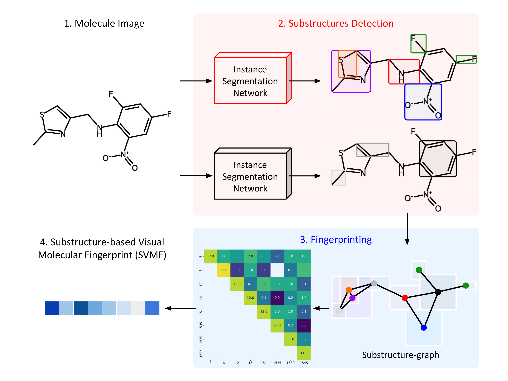

# SubGrapher-IBM

[](https://huggingface.co/datasets/ds4sd/SubGrapher-Datasets)
[](https://doi.org/10.48550/arXiv:2504.19695)
[](https://jcheminf.biomedcentral.com/articles/10.1186/s13321-025-01091-4)

This repository is the internal version of the public SubGrapher repository. 

This is the repository for [SubGrapher: Visual Fingerprinting of Chemical Structures](https://jcheminf.biomedcentral.com/articles/10.1186/s13321-025-01091-4). SubGrapher is a model to detect functional groups in molecules images and convert them into visual fingerprints.



### Citation

If you find this repository useful, please consider citing:
```
@article{Morin2025,
	title        = {{Subgrapher: visual fingerprinting of chemical structures}},
	author       = {Morin, Lucas and Meijer, Gerhard Ingmar and Weber, Val{\'e}ry and Van Gool, Luc and Staar, Peter W. J.},
	year         = 2025,
	month        = {Sep},
	day          = 29,
	journal      = {Journal of Cheminformatics},
	volume       = 17,
	number       = 1,
	pages        = 149,
	doi          = {10.1186/s13321-025-01091-4},
	issn         = {1758-2946},
    url          = {https://doi.org/10.1186/s13321-025-01091-4}
}
```

### Installation

Create a virtual environment.

```
python3.11 -m venv subgrapher-env
source subgrapher-env/bin/activate
```

Install SubGrapher.
```
pip install -e .
```

### Inference

#### Script

1. Place your input images in: `SubGrapher/data/images/default/`.

2. Run SubGrapher:
```
python3 subgrapher/scripts/run.py
```

3. Read predictions in: `SubGrapher/data/predictions/default/`. 
Predictions are structured as follows:
```
{
    "substructure": "Amine_(tertiary)",       # Predicted substructure                               
    "confidence": 1.0,                        # Model confidence
    "bbox": [525.3, 273.7, 675.8, 403.7],     # Predicted bounding box
    "type": "functional-groups"               # Substructure type (functional-groups or carbon-chains)
}
...
```

4. (Optional) Read visualizations in: `SubGrapher/data/visualization/default/`.
Visualizations are structured as follows:
```
SubGrapher/data/visualization/default/
├── US07320977-20080122-C00078_fingerprint.png          # Visualization of the SVMF 
├── US07320977-20080122-C00078_substructures.png        # Visualization of predicted substructures
├── US07320977-20080122-C00078_substructures.txt        # Labels of predicted substructures
...
```

### Model

The model weights are available on [Hugging Face](https://huggingface.co/ds4sd/SubGrapher). They are automatically downloaded when running the model's inference. 

### Evaluation Dataset

The benchmarks used for the visual fingerprinting evaluation are available on [HuggingFace](https://huggingface.co/datasets/ds4sd/SubGrapher-Datasets/) (download size: 50 MB).
```
wget https://huggingface.co/datasets/ds4sd/SubGrapher-Datasets/resolve/main/benchmarks.zip
```

The benchmarks are structured as follows:
```
benchmarks/
├── adenosine/                          # Benchmark (Adenosine, Camphor, Cholesterol, Limonene, or Pyridine.)
│   ├── 90.csv/                         # SMILES 
│   └── adenosine/                      
│        ├── images_2/                  # Images 
│        └── molfiles/                  # MolFiles 
...
```